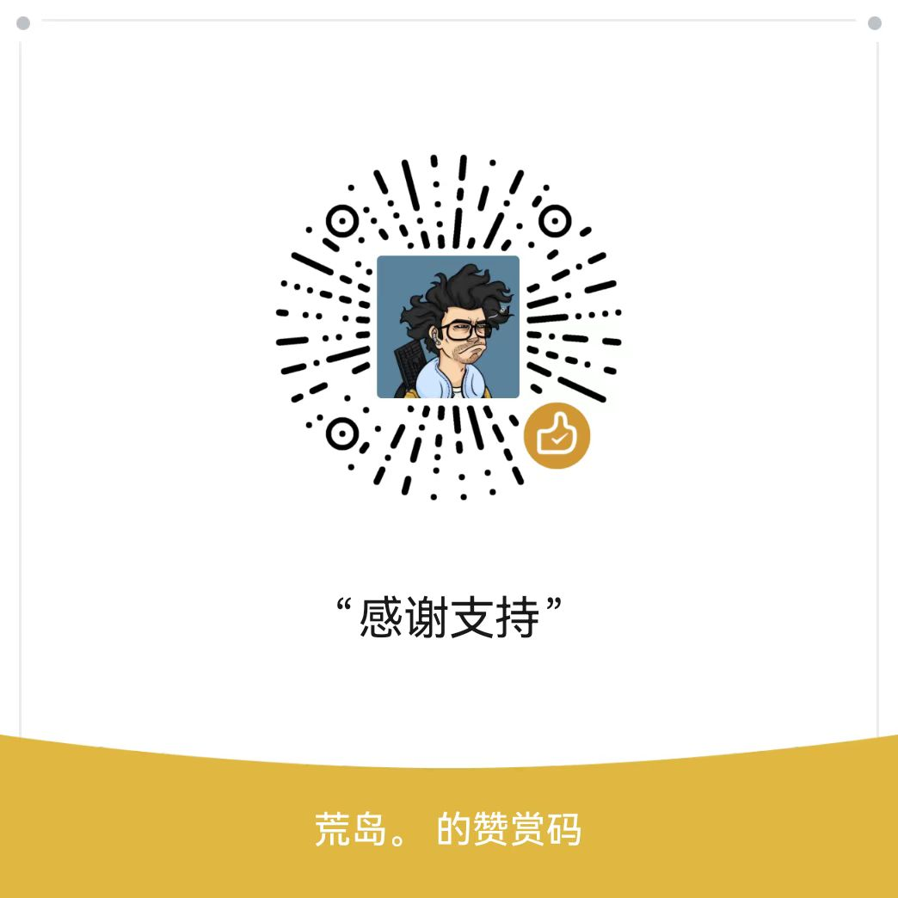

<h1 align="center">
    
   
<!--   Easily create personalized background images -->
</h1>

   <a href="README_EN.md"> English <a/> | 中文

     
**BackArt** 是一个基于 Flutter
开发的应用程序，帮助你轻松创建简约且时尚的图片，支持自定义背景色、文字和水印。无论你是想设计个性化的手机壁纸、或是为社交媒体创建内容，
**BackArt**都能为你提供便捷的创作体验。

## 功能特色

- [x] 自定义背景色

* 自由调整背景颜色，选出自己喜欢的背景

- [x] 文字定制：

* 字体选择：提供14种内置字体
* 对齐方式：支持文字左对齐，居中对齐，右对齐三种方式
* 文字布局：支持文本块在背景中九个位置的布局方式
* 排版调整：支持文字字号和行距的调整

- [x] 水印功能

* 位置选择：可以加入自已的@水印，支持在布局上下六个位置自由调整

- [x] 社交媒体支持

* 推荐比例：选择内置各平台推荐的图片比例选择，默认本机。

- [x] 导出选项

* 支持图片导出到图库

- [x] 国际化

* 支持中文、英文。默认系统语言，可以在设置中调整

## 示例

## 联系我

如果你有任何问题或建议，欢迎通过以下方式与我们联系：

* 邮箱：1327603193@qq.com
* GitHub Issues

## 特别说明

由于项目代码目前并不优美，没有什么能让大家学习的地方，所以目前并未提供源码。后续代码优化过后，好看一些，会考虑发布源码。但是如果有朋友需要源码或是想自己构建App，也可以找我，给诸位提供源码。

## 支持

