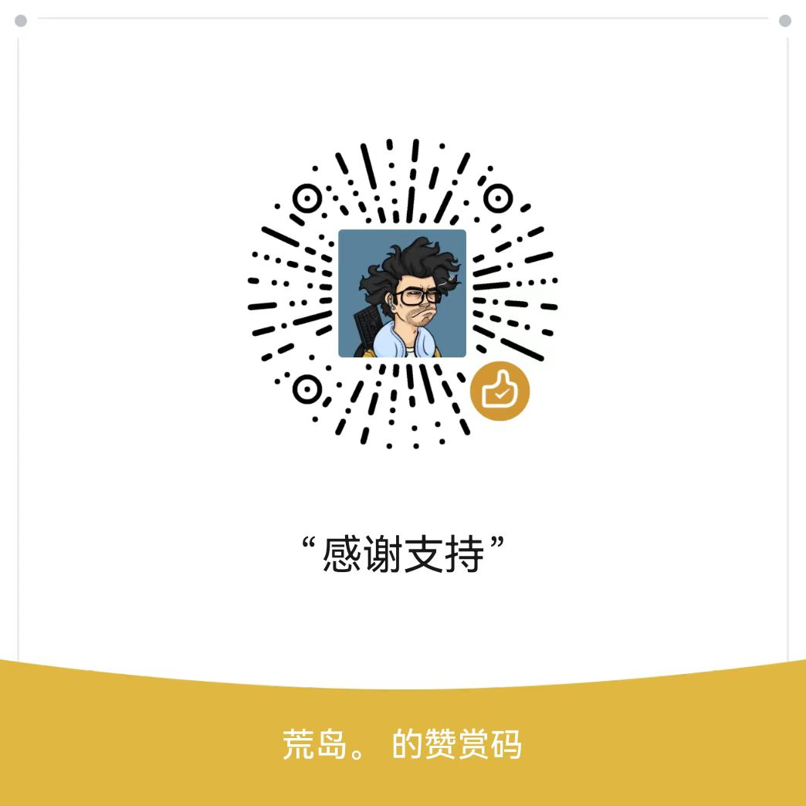

<h1 align="center">
    
   
<!--   Easily create personalized background images -->
</h1>

   English | <a href="README_EN.md">中文</a>

     

**BackArt** is a Flutter-based application that helps you easily create simple yet stylish images, supporting customizable background colors, text, and watermarks. Whether you want to design personalized phone wallpapers or create content for social media, **BackArt** provides you with a convenient creative experience.

## Features

- [x] Custom Background Colors

  * Freely adjust the background color to select your preferred shade.

- [x] Text Customization:

  * Font Selection: Choose from 14 built-in fonts.
  * Alignment Options: Supports left, center, and right text alignment.
  * Text Layout: Allows text blocks to be positioned in nine different areas on the background.
  * Typography Adjustments: Supports text size and line spacing adjustments.

- [x] Watermark Functionality

  * Positioning Options: Add your own @watermark with the ability to freely adjust its position in six different locations.

- [x] Social Media Support

  * Recommended Ratios: Choose from built-in aspect ratios recommended for various platforms, with your device's default as the starting point.

- [x] Export Options

  * Support for exporting images to your gallery.

- [x] Localization

  * Supports both Chinese and English, with the app defaulting to the system language. You can change the language in the settings.

## Examples

Here are some personalized background images created with BackArt:

  
  
  

  
 

## Contact Me

If you have any questions or suggestions, feel free to contact me:

* Email: <a href="mailto:1327603193@qq.com">1327603193@qq.com</a>
* GitHub Issues

## Special Notes

The current code is not yet optimized and may not provide much learning value. Therefore, the source code is not currently available. However, after optimizing the code and improving its quality, I may consider releasing the source code. If you need the source code or want to build the app yourself, feel free to  <a href="mailto:1327603193@qq.com">contact me</a> for the code.

## Support

